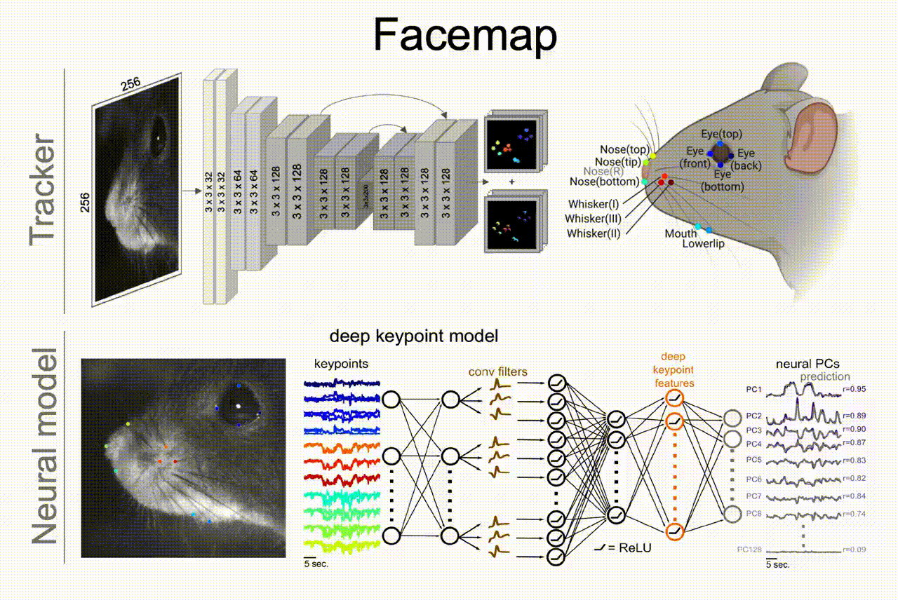
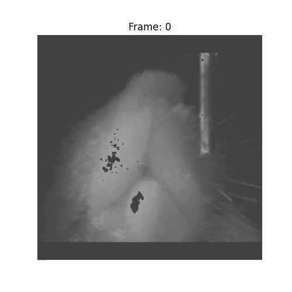

My research lies at the intersection of systems neuroscience, computation, and behavior. I investigate how unconstrained, spontaneous behaviors shape neural activity in a behaving animal. By developing scalable, open-source computational tools alongside large-scale neural recordings, my work aims to discover behavioral features shaping cortical computation.

  Neuroscience

  Artificial Intelligence

  Deep Learning

  Computational Neuroscience

  Large-scale data analysis

---

### High-Dimensional Behavior to Neural Activity Prediction
To understand the relationship between spontaneous behavior and neural activity, the field of systems neuroscience required automated pipelines. I developed **Facemap**, a framework that utilizes deep learning to track, model, and reduce the dimensionality of complex orofacial movements from raw video data. 

::: {layout-ncol=2}
{width="200%"}

Facemap predicts neural activity driven by mouse orofacial movements across cortical regions. It includes pose estimation for tracking facial keypoints and a neural network model that maps behavior to neural responses. The package is implemented in python and utilizes a number of open-source packages, such as pytorch and opencv.
:::

  <a href="https://www.nature.com/articles/s41593-023-01490-6" class="text-decoration-none me-3"><i class="bi bi-file-earmark-text"></i> Nature Neuroscience Paper</a>
  <a href="https://github.com/MouseLand/facemap" target="_blank" class="text-decoration-none me-3"><i class="bi bi-github"></i> Facemap</a>
  <a href="https://facemap.readthedocs.io" target="_blank" class="text-decoration-none"><i class="bi bi-book"></i> Documentation</a>
  <a href="https://www.youtube.com/live/auVifWwQaG8?si=-n5srMS85gi-iLid&t=7392" target="_blank" class="text-decoration-none"><i class="bi bi-play-circle"></i> COSYNE Talk</a>

---

::: {layout-ncol=2}
### Modeling Behavior via Soft-body Object Recognition
This project focuses on image segmentation of soft-body objects using convolution neural networks. Specifically, the project uses data from a high-speed imaging camera to perform image segmentation to identify and track a soft-body object, i.e. tongue, from static images of mouse faces recorded from a bottom view camera. To perform image segmentation, the project compares different convolution neural networks, including UNet, UNet++, and DeepLabV3, to find a model with the best generalization and test accuracy for the image segmentation task.

{width="100%"}

  <a href="https://github.com/Atika-Syeda/TongueSegmentation/blob/main/syeda-final_report.pdf" class="text-decoration-none me-3"><i class="bi bi-file-earmark-text"></i> Project report</a>
  <a href="https://github.com/Atika-Syeda/TongueSegmentation" target="_blank" class="text-decoration-none me-3"><i class="bi bi-github"></i> Project Code</a>

:::

---

### Research Tools

I employ a variety of methodologies in my research, including:

- **Data Analysis**: Supervised and unsupervised machine learning, deep learning, signal processing techniques
- **Programming Languages**: Python, MATLAB, R, Java
- **Machine Learning Frameworks**: PyTorch, TensorFlow